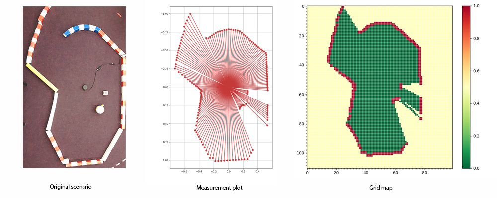
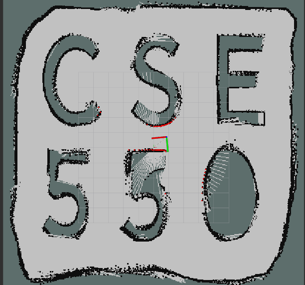

# 2D Lidar Sensor to  OccupancyGrid
ROS package to create OccupancyGrid from LaserScan

Detail project description [link](https://amitrokh.github.io/CMSC498F/assignments/assignment_4/doc/project_4.pdf)

## Reference
[link](https://github.com/ksvbka/PythonRobotics/blob/master/Mapping/lidar_to_grid_map/lidar_to_grid_map_tutorial.ipynb)

## Result

